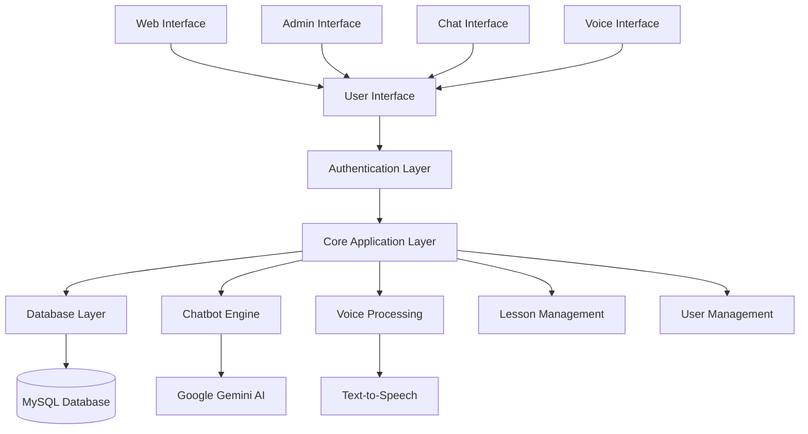
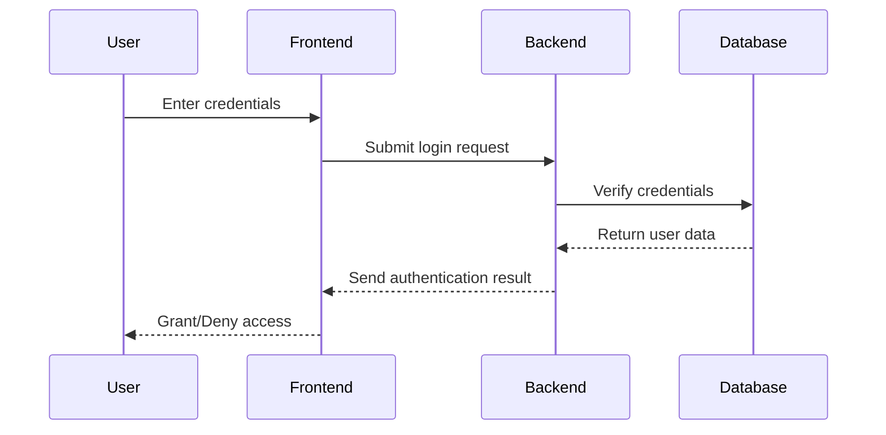
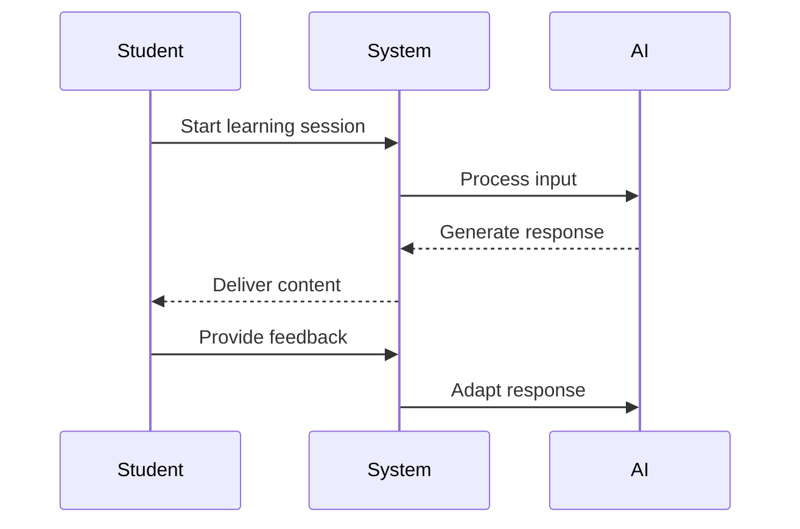

# Hệ Thống Chatbot Dạy Tiếng Anh

## Tổng Quan Hệ Thống

Đây là hệ thống dạy tiếng Anh được hỗ trợ bởi trí tuệ nhân tạo (AI), kết hợp khả năng chatbot với các tính năng quản trị cho người dùng và bài học. Hệ thống cung cấp trải nghiệm học tập tương tác thông qua trò chuyện văn bản, tương tác giọng nói và các bài học có cấu trúc.

## Kiến Trúc Hệ Thống



## Tính Năng

### 1. Quản Lý Người Dùng
- **Hệ Thống Xác Thực**
  - Đăng ký và đăng nhập người dùng
  - Kiểm soát truy cập dựa trên vai trò (Admin/User)
  - Xử lý mật khẩu an toàn

- **Bảng Điều Khiển Admin**
  - Thao tác CRUD với người dùng
  - Quản lý vai trò
  - Giám sát hoạt động người dùng

### 2. Tính Năng Học Tập
- **Chatbot Tương Tác**
  - Hội thoại ngôn ngữ tự nhiên
  - Phản hồi theo ngữ cảnh
  - Theo dõi tiến trình học tập

- **Tương Tác Giọng Nói**
  - Nhận dạng giọng nói
  - Chuyển đổi văn bản thành giọng nói
  - Bài tập học dựa trên giọng nói

- **Bài Học Có Cấu Trúc**
  - Tài liệu học tập theo chủ đề
  - Các cấp độ khó tăng dần
  - Theo dõi hiệu suất

### 3. Tính Năng Quản Trị
- **Quản Lý Bài Học**
  - Tạo và chỉnh sửa bài học
  - Tổ chức nội dung học tập
  - Theo dõi hiệu quả bài học

- **Giao Diện Truy Vấn**
  - Quản lý cơ sở dữ liệu
  - Giám sát hệ thống
  - Phân tích hiệu suất

## Kiến Trúc Kỹ Thuật

### Frontend (Giao Diện Người Dùng)
- HTML5, CSS3, JavaScript
- Thiết kế tương thích đa thiết bị
- Các thành phần UI tương tác
- Cập nhật thời gian thực

### Backend (Máy Chủ)
- **Framework**: Flask (Python)
- **Tích Hợp AI**: Google Gemini AI
- **Xử Lý Giọng Nói**: Text-to-Speech (gTTS)
- **Cơ Sở Dữ Liệu**: MySQL

### Database Schema

```sql
users (
    id INT AUTO_INCREMENT PRIMARY KEY,
    username VARCHAR(100) NOT NULL,
    email VARCHAR(100) NOT NULL UNIQUE,
    password VARCHAR(255) NOT NULL,
    role ENUM('user','admin') DEFAULT 'user',
    created_at TIMESTAMP DEFAULT CURRENT_TIMESTAMP
)
```

## System Workflow

1. **User Authentication Flow**


2. **Learning Session Flow**


## Cài Đặt và Thiết Lập

1. **Yêu Cầu Hệ Thống**
   - Python 3.x
   - MySQL Server
   - Các gói Python cần thiết (xem requirements.txt)

2. **Thiết Lập Môi Trường**
   ```bash
   # Sao chép kho lưu trữ
   git clone <repository-url>

   # Cài đặt các gói phụ thuộc
   pip install -r requirements.txt

   # Cấu hình cơ sở dữ liệu
   # Chỉnh sửa config_py.py với thông tin đăng nhập MySQL của bạn
   ```

3. **Khởi Tạo Cơ Sở Dữ Liệu**
   ```python
   # Hệ thống sẽ tự động:
   - Tạo cơ sở dữ liệu cần thiết
   - Khởi tạo các bảng
   - Tạo tài khoản admin mặc định
   ```

4. **Khởi Động Ứng Dụng**
   ```bash
   python agent.py
   ```

## Cấu Hình

Hệ thống sử dụng các tệp cấu hình sau:
- `config_py.py`: Cài đặt cơ sở dữ liệu và hệ thống
- `prompt.py`: Mẫu hội thoại AI
- `save_mysql.py`: Thao tác với cơ sở dữ liệu

## Các Điểm Cuối API

### Xác Thực
- `POST /register`: Đăng ký người dùng
- `POST /login`: Đăng nhập người dùng

### Quản Lý Người Dùng
- `GET /get_all/users`: Lấy danh sách tất cả người dùng
- `POST /add/users`: Thêm người dùng mới
- `PUT /update_user`: Cập nhật thông tin người dùng
- `DELETE /delete_user/<id>`: Xóa người dùng

### Tính Năng Học Tập
- `POST /chat`: Tương tác với chatbot
- `POST /generate/lesson/<topic>`: Tạo nội dung bài học
- `POST /start_record`: Bắt đầu ghi âm
- `POST /stop_record`: Dừng ghi âm

## Tính Năng Bảo Mật

- Mã hóa mật khẩu
- Kiểm soát truy cập dựa trên vai trò
- Quản lý phiên làm việc
- Xác thực dữ liệu đầu vào
- Ngăn chặn SQL injection

## Kế Hoạch Phát Triển Tương Lai

1. **Tính Năng Học Tập**
   - Theo dõi tiến độ nâng cao
   - Lộ trình học tập cá nhân hóa
   - Bài tập tương tác

2. **Cải Tiến Kỹ Thuật**
   - Tính năng chat thời gian thực
   - Nâng cao nhận dạng giọng nói
   - Tối ưu hóa hiệu suất

3. **Công Cụ Quản Trị**
   - Phân tích nâng cao
   - Quản lý người dùng hàng loạt
   - Tạo báo cáo tùy chỉnh

## Đóng Góp

Vui lòng đọc hướng dẫn đóng góp của chúng tôi trước khi gửi pull request.

## Giấy Phép

Dự án này được cấp phép theo Giấy phép MIT - xem tệp LICENSE để biết chi tiết.