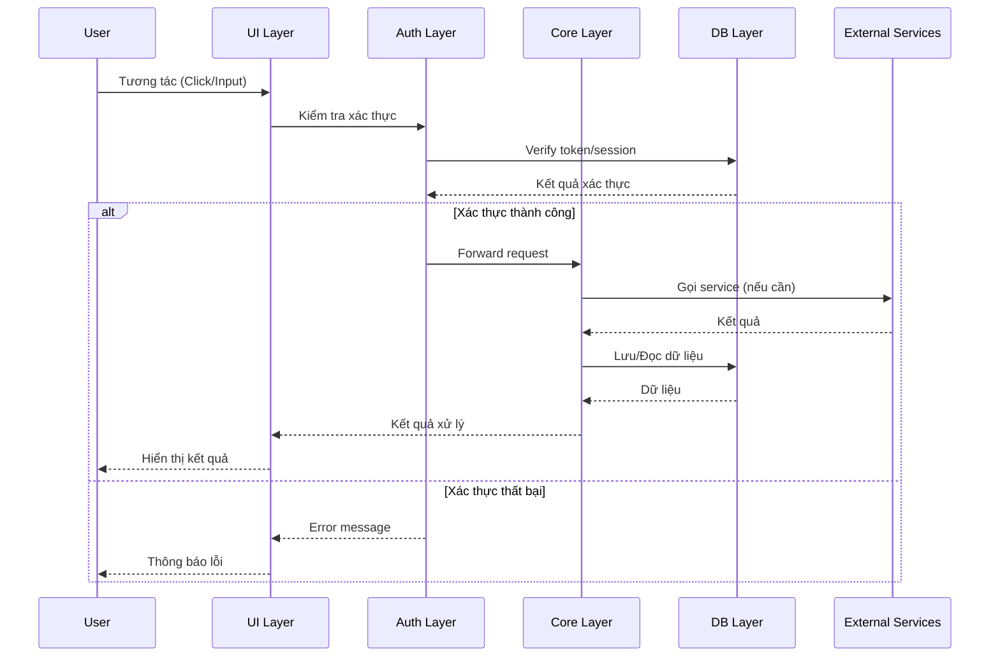
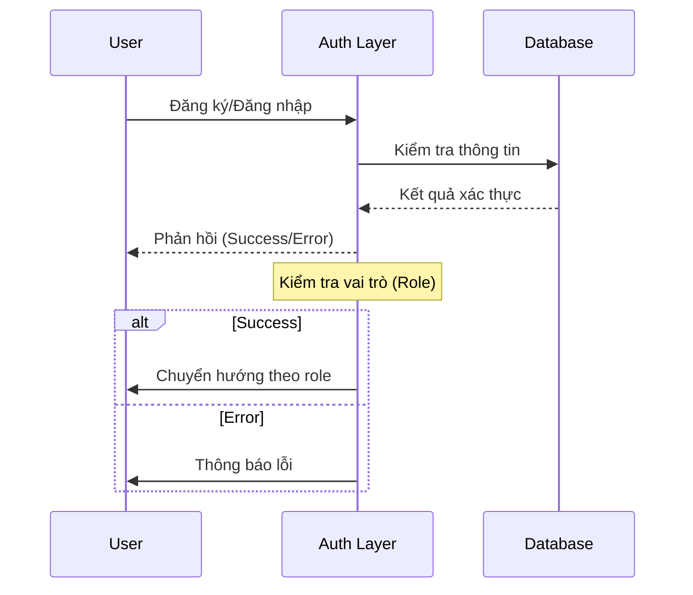
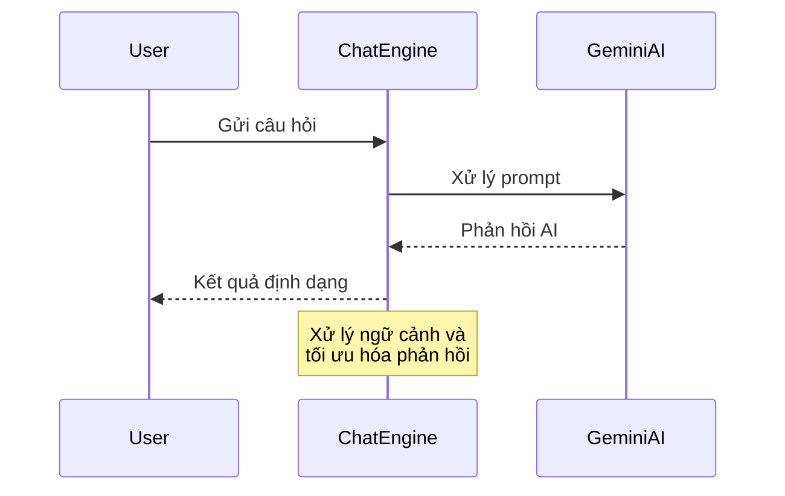
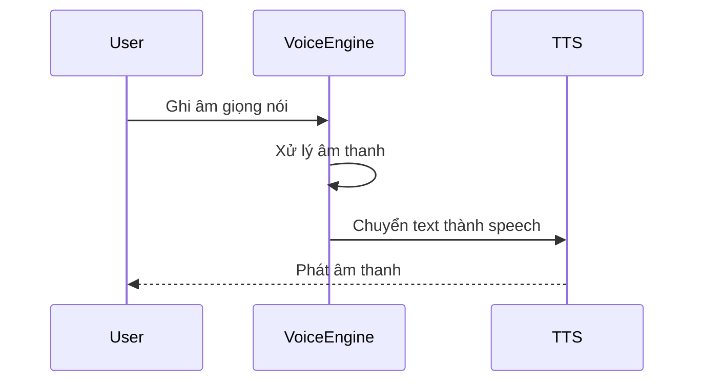
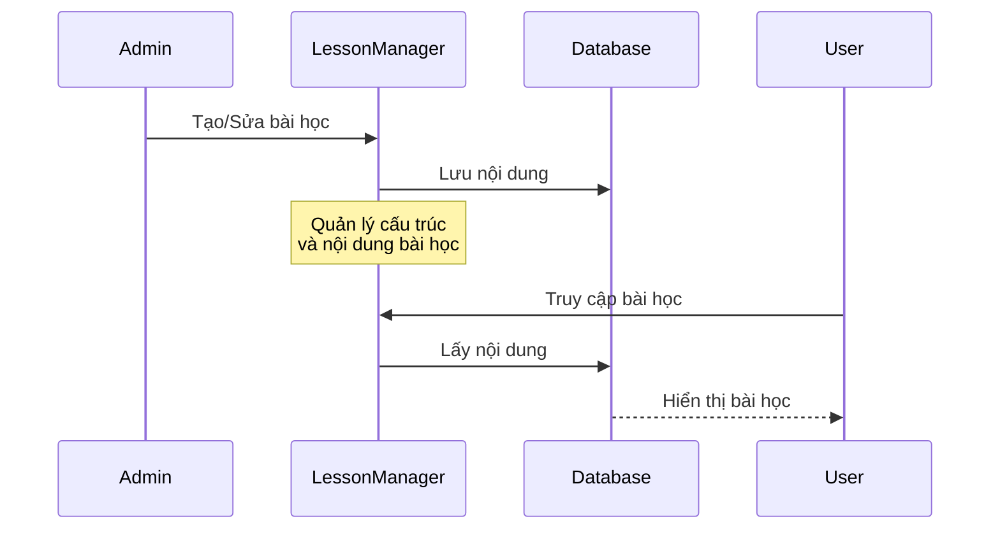
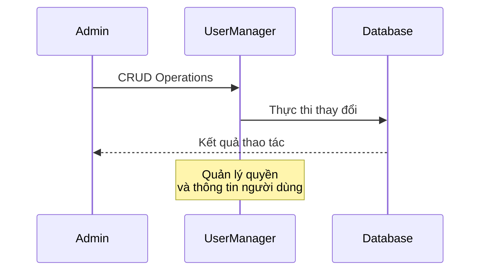

# Hệ Thống Chatbot Dạy Tiếng Anh

## Tổng Quan Hệ Thống

Đây là hệ thống dạy tiếng Anh được hỗ trợ bởi trí tuệ nhân tạo (AI), kết hợp khả năng chatbot với các tính năng quản trị cho người dùng và bài học. Hệ thống cung cấp trải nghiệm học tập tương tác thông qua trò chuyện văn bản, tương tác giọng nói và các bài học có cấu trúc.

## Kiến Trúc Hệ Thống

### 1. Tổng Quan Kiến Trúc

#### 1.1 Sơ Đồ Tổng Thể
```mermaid
graph TD
    A[User Interface Layer] --> B[Authentication Layer]
    B --> C[Core Application Layer]
    C --> D[Database Layer]

    %% User Interface Components
    A1[Web Interface] --> A
    A2[Admin Interface] --> A
    A3[Chat Interface] --> A
    A4[Voice Interface] --> A

    %% Core Application Components
    C --> C1[Chatbot Engine]
    C --> C2[Voice Processing Pipeline]
    C --> C3[Lesson Management]
    C --> C4[User Management]

    %% Voice Processing Sub-components
    C2 --> C2a[Mic Input & Audio Capture]
    C2 --> C2b[Noise Filtering & Preprocessing]
    C2 --> C2c[Speech-to-Text (STT)]
    C2 --> C2d[Text Sentiment/Intent Analysis]
    C2 --> C2e[AI Engine Query]
    C2 --> C2f[Text-to-Speech (TTS) Output]
    C2a --> C2b
    C2b --> C2c
    C2c --> C2d
    C2d --> C2e
    C2e --> C2f
    C2f --> A4

    %% Database Interactions
    D --> D1[(MySQL Database)]
    C1 --> D1
    C4 --> D1
    C3 --> D1

    %% External Services
    C1 --> E1[Google Gemini AI / LLM]
    C2c --> E2[Google Speech-to-Text / Whisper]
    C2f --> E3[Google Text-to-Speech / ElevenLabs / Coqui TTS]
```

#### 1.2 Chi Tiết Các Layer và Luồng Xử Lý

##### A. User Interface Layer
1. **Web Interface (A1)**
   - Xử lý tương tác người dùng thông qua các trang web
   - Gửi/nhận requests đến Authentication Layer
   - Hiển thị kết quả và phản hồi từ hệ thống
   - Các trang chính: index, login, chatbot, lesson, voice

2. **Admin Interface (A2)**
   - Giao diện quản trị viên
   - Quản lý users, lessons, và truy vấn database
   - Dashboard theo dõi hoạt động hệ thống
   - Các trang: ad_user, ad_lesson, ad_query

3. **Chat Interface (A3)**
   - Giao diện chat với AI
   - Xử lý tin nhắn real-time
   - Hiển thị lịch sử chat
   - Tích hợp với Chatbot Engine

4. **Voice Interface (A4)**
   - Ghi âm và phát âm thanh
   - Xử lý tương tác voice
   - Kết nối với Voice Processing Engine

##### B. Authentication Layer
1. **Xử lý Đăng Nhập/Đăng Ký**
   ```mermaid
   sequenceDiagram
       User->>Auth: Gửi thông tin đăng nhập
       Auth->>Database: Kiểm tra credentials
       Database-->>Auth: Xác thực thông tin
       Auth-->>User: JWT Token + Role
   ```

2. **Quản Lý Phiên và Phân Quyền**
   - Tạo và quản lý JWT tokens
   - Phân quyền dựa trên role (admin/user)
   - Bảo mật các routes và API endpoints

##### C. Core Application Layer
1. **Chatbot Engine (C1)**
   - Xử lý ngôn ngữ tự nhiên
   - Tích hợp với Google Gemini AI
   - Quản lý context và flow hội thoại
   - Tối ưu hóa prompt và phản hồi

2. **Voice Processing (C2)**
   - Chuyển đổi text-to-speech và ngược lại
   - Xử lý file âm thanh
   - Tích hợp với gTTS service
   - Buffer và stream xử lý

3. **Lesson Management (C3)**
   - CRUD operations cho bài học
   - Quản lý cấu trúc và nội dung
   - Theo dõi tiến độ học tập
   - Phân tích hiệu quả bài học

4. **User Management (C4)**
   - Quản lý thông tin người dùng
   - Phân quyền và roles
   - Theo dõi hoạt động
   - Báo cáo và thống kê

##### D. Database Layer
1. **Cấu Trúc Database**
   ```sql
   -- User Management
   CREATE TABLE users (
       id INT AUTO_INCREMENT PRIMARY KEY,
       username VARCHAR(100) NOT NULL,
       email VARCHAR(100) NOT NULL UNIQUE,
       password VARCHAR(255) NOT NULL,
       role ENUM('user','admin') DEFAULT 'user',
       created_at TIMESTAMP DEFAULT CURRENT_TIMESTAMP
   );

   -- Sẽ bổ sung thêm các bảng khác cho lessons, chat history, etc.
   ```

2. **Tương Tác Database**
   - Connection pooling và quản lý kết nối
   - Transaction management
   - Query optimization
   - Data backup và recovery

#### 1.3 Luồng Xử Lý Chính



### 2. Chi Tiết Các Layer

#### 2.1 User Interface Layer
- **Web Interface**: Giao diện người dùng chính
  - Trang chủ (`index.html`)
  - Trang đăng nhập (`login.html`)
  - Trang chatbot (`chatbot.html`)
  - Trang bài học (`lesson.html`)
  - Trang voice (`voice.html`)

- **Admin Interface**: Giao diện quản trị
  - Quản lý người dùng (`ad_user.html`)
  - Quản lý bài học (`ad_lesson.html`)
  - Quản lý truy vấn (`ad_query.html`)

#### 2.2 Authentication Layer


#### 2.3 Core Application Layer

##### 2.3.1 Chatbot Engine Flow


##### 2.3.2 Voice Processing Flow


##### 2.3.3 Lesson Management Flow


##### 2.3.4 User Management Flow


#### 2.4 Database Layer

##### Cấu Trúc Database
```sql
-- Bảng Users
CREATE TABLE users (
    id INT AUTO_INCREMENT PRIMARY KEY,
    username VARCHAR(100) NOT NULL,
    email VARCHAR(100) NOT NULL UNIQUE,
    password VARCHAR(255) NOT NULL,
    role ENUM('user','admin') DEFAULT 'user',
    created_at TIMESTAMP DEFAULT CURRENT_TIMESTAMP
);

-- Các bảng khác sẽ được thêm khi cần thiết
```

### 3. Luồng Xử Lý Chính

#### 3.1 Luồng Đăng Nhập/Xác Thực
1. User nhập thông tin đăng nhập
2. Frontend gửi request đến `/login`
3. Backend kiểm tra credentials trong database
4. Trả về token và role nếu thành công
5. Chuyển hướng user dựa trên role

#### 3.2 Luồng Chat với AI
1. User gửi câu hỏi qua giao diện chat
2. Request được gửi đến endpoint `/chat`
3. Backend xử lý với Google Gemini AI
4. Format và trả về kết quả cho user

#### 3.3 Luồng Xử Lý Voice
1. User bắt đầu ghi âm (`/start_record`)
2. Backend lưu file âm thanh
3. Xử lý âm thanh thành text
4. Chuyển text thành speech response
5. Trả về file âm thanh cho user

#### 3.4 Luồng Quản Lý Admin
1. Admin truy cập các trang quản lý
2. Thực hiện các thao tác CRUD
3. Backend xử lý và cập nhật database
4. Trả về kết quả và cập nhật UI

## Tính Năng

### 1. Quản Lý Người Dùng
- **Hệ Thống Xác Thực**
  - Đăng ký và đăng nhập người dùng
  - Kiểm soát truy cập dựa trên vai trò (Admin/User)
  - Xử lý mật khẩu an toàn

- **Bảng Điều Khiển Admin**
  - Thao tác CRUD với người dùng
  - Quản lý vai trò
  - Giám sát hoạt động người dùng

### 2. Tính Năng Học Tập
- **Chatbot Tương Tác**
  - Hội thoại ngôn ngữ tự nhiên
  - Phản hồi theo ngữ cảnh
  - Theo dõi tiến trình học tập

- **Tương Tác Giọng Nói**
  - Nhận dạng giọng nói
  - Chuyển đổi văn bản thành giọng nói
  - Bài tập học dựa trên giọng nói

- **Bài Học Có Cấu Trúc**
  - Tài liệu học tập theo chủ đề
  - Các cấp độ khó tăng dần
  - Theo dõi hiệu suất

### 3. Tính Năng Quản Trị
- **Quản Lý Bài Học**
  - Tạo và chỉnh sửa bài học
  - Tổ chức nội dung học tập
  - Theo dõi hiệu quả bài học

- **Giao Diện Truy Vấn**
  - Quản lý cơ sở dữ liệu
  - Giám sát hệ thống
  - Phân tích hiệu suất

## Kiến Trúc Kỹ Thuật

### Frontend (Giao Diện Người Dùng)
- HTML5, CSS3, JavaScript
- Thiết kế tương thích đa thiết bị
- Các thành phần UI tương tác
- Cập nhật thời gian thực

### Backend (Máy Chủ)
- **Framework**: Flask (Python)
- **Tích Hợp AI**: Google Gemini AI
- **Xử Lý Giọng Nói**: Text-to-Speech (gTTS)
- **Cơ Sở Dữ Liệu**: MySQL

### Database Schema

```sql
users (
    id INT AUTO_INCREMENT PRIMARY KEY,
    username VARCHAR(100) NOT NULL,
    email VARCHAR(100) NOT NULL UNIQUE,
    password VARCHAR(255) NOT NULL,
    role ENUM('user','admin') DEFAULT 'user',
    created_at TIMESTAMP DEFAULT CURRENT_TIMESTAMP
)
```

## System Workflow

1. **User Authentication Flow**


2. **Learning Session Flow**


## Cài Đặt và Thiết Lập

1. **Yêu Cầu Hệ Thống**
   - Python 3.x
   - MySQL Server
   - Các gói Python cần thiết (xem requirements.txt)

2. **Thiết Lập Môi Trường**
   ```bash
   # Sao chép kho lưu trữ
   git clone <repository-url>

   # Cài đặt các gói phụ thuộc
   pip install -r requirements.txt

   # Cấu hình cơ sở dữ liệu
   # Chỉnh sửa config_py.py với thông tin đăng nhập MySQL của bạn
   ```

3. **Khởi Tạo Cơ Sở Dữ Liệu**
   ```python
   # Hệ thống sẽ tự động:
   - Tạo cơ sở dữ liệu cần thiết
   - Khởi tạo các bảng
   - Tạo tài khoản admin mặc định
   ```

4. **Khởi Động Ứng Dụng**
   ```bash
   python agent.py
   ```

## Cấu Hình

Hệ thống sử dụng các tệp cấu hình sau:
- `config_py.py`: Cài đặt cơ sở dữ liệu và hệ thống
- `prompt.py`: Mẫu hội thoại AI
- `save_mysql.py`: Thao tác với cơ sở dữ liệu

## Các Điểm Cuối API

### Xác Thực
- `POST /register`: Đăng ký người dùng
- `POST /login`: Đăng nhập người dùng

### Quản Lý Người Dùng
- `GET /get_all/users`: Lấy danh sách tất cả người dùng
- `POST /add/users`: Thêm người dùng mới
- `PUT /update_user`: Cập nhật thông tin người dùng
- `DELETE /delete_user/<id>`: Xóa người dùng

### Tính Năng Học Tập
- `POST /chat`: Tương tác với chatbot
- `POST /generate/lesson/<topic>`: Tạo nội dung bài học
- `POST /start_record`: Bắt đầu ghi âm
- `POST /stop_record`: Dừng ghi âm

## Tính Năng Bảo Mật

- Mã hóa mật khẩu
- Kiểm soát truy cập dựa trên vai trò
- Quản lý phiên làm việc
- Xác thực dữ liệu đầu vào
- Ngăn chặn SQL injection

## Kế Hoạch Phát Triển Tương Lai

1. **Tính Năng Học Tập**
   - Theo dõi tiến độ nâng cao
   - Lộ trình học tập cá nhân hóa
   - Bài tập tương tác

2. **Cải Tiến Kỹ Thuật**
   - Tính năng chat thời gian thực
   - Nâng cao nhận dạng giọng nói
   - Tối ưu hóa hiệu suất

3. **Công Cụ Quản Trị**
   - Phân tích nâng cao
   - Quản lý người dùng hàng loạt
   - Tạo báo cáo tùy chỉnh

## Đóng Góp

Vui lòng đọc hướng dẫn đóng góp của chúng tôi trước khi gửi pull request.

## Giấy Phép

Dự án này được cấp phép theo Giấy phép MIT - xem tệp LICENSE để biết chi tiết.